# Unlocking Code Excellence: The Synergy of Human Insight and Automation in Modern Code Reviews

---

## 📋 Agenda

1. **Opening: The Code Review Revolution**
2. **Code Review Fundamentals**
   - What is a Code Review?
   - Why Reviews Matter More Than Ever
3. **The Human Element**
   - Setting Clear Goals
   - Choosing the Right Reviewers
   - Timing is Everything
4. **The Review Process**
   - Comprehensive Review Checklist
   - Best Practices for Reviewers
   - Best Practices for Authors
   - Common Pitfalls & How to Dodge Them
5. **Automation Superpowers for Azure DevOps**
   - Code Style Automation
   - Testing Automation
   - Git Hooks & Commit Standards
   - PR Templates & Branch Policies
   - Quality Gates
6. **SonarQube: Your Code Quality Guardian**
   - Understanding SonarQube
   - Integration with Azure DevOps
7. **Security Testing Trinity: SAST, SCA & DAST**
8. **Metrics That Matter**
9. **Q&A and Interactive Discussion**

---

## Slide 1: Opening - The Code Review Revolution 🚀

## "Honest question: When you see a code review notification, what's your first reaction?"

**Speaker Notes:**
- Start with a smile and this thought-provoking question
- Share a quick personal anecdote about a bug that could have been prevented
- Set the tone: "Today, we're going to transform code reviews from a chore into your team's superpower"


---

## Slide 2: What is a Code Review? 🔍

### "Code review is like having a co-pilot check your work before takeoff"

**Definition:** A systematic examination of source code intended to find bugs, ensure quality, and share knowledge before merging changes into the main codebase.

**The Three Pillars of Code Review:**


**Speaker Notes:**
- Ask the audience: "Who here has ever pushed code directly to production without review?" 
- Follow up: "And who regretted it?" (Usually gets laughs)
- Emphasize that code review is not about finding fault, but about building excellence together

---

## Slide 3: Why Code Reviews Are Essential 💎

### The Million Dollar Question: "What's the cost of a bug in production vs. in review?"

**The Impact Numbers:**
- 🐛 **Bug Detection:** Catches 60-90% of defects before production
- 💰 **Cost Savings:** Fixing a bug in review costs 10x less than in production
- 🧠 **Knowledge Transfer:** New team members onboard 50% faster
- 📈 **Code Quality:** Reduces technical debt by 40%


**Real-World Example:**
> "Remember the Knight Capital Group? A single uncaught bug in 2012 cost them $440 million in 45 minutes. One code review could have saved a company."

**Speaker Notes:**
- Use the Knight Capital story as a cautionary tale
- Ask: "Anyone have a production bug horror story to share?" (Keep it brief)
- Transition: "Now let's see how to do reviews RIGHT"

---

## Slide 4: Defining Clear Code Review Goals 🎯

### Ask Yourself: "What are we trying to achieve with THIS review?"

**The SMART Goals Framework for Code Reviews:**


**Goal Categories:**
1. **🛡️ Security:** "Will this code keep the hackers out?"
2. **⚡ Performance:** "Will this scale when we go viral?"
3. **🏗️ Architecture:** "Will future-me thank present-me for this design?"
4. **📚 Readability:** "Can a junior developer understand this in 6 months?"

**Speaker Notes:**
- Emphasize: "Without clear goals, reviews become bike-shedding sessions"
- Share example: "I once saw a team spend 2 hours debating variable names while missing a SQL injection vulnerability"
- Ask audience to think about their current review goals

---

## Slide 5: Identifying the Right Reviewers 👥

### "You wouldn't ask a cardiologist to perform brain surgery, right?"

**The Reviewer Selection Matrix:**


**The Perfect Review Team Formula:**
- **1 Domain Expert:** Knows the business logic
- **1 Technical Expert:** Understands the architecture
- **1 Fresh Eyes:** Someone unfamiliar brings new perspective

**Pro Tip:** Rotate reviewers to spread knowledge and prevent review fatigue!

**Speaker Notes:**
- Tell the story: "I once had a database expert review my UI code. They found 3 performance issues I never would have considered"
- Emphasize diversity in reviewers
- Mention the "two-pizza rule" - if your review team can't be fed with two pizzas, it's too big

---

## Slide 6: The Optimal Time for Code Reviews ⏰

### "Timing in code reviews is like timing in comedy - get it wrong, and nobody's happy"

**When to Request Reviews:**


**The Golden Rules of Review Timing:**
1. **📝 After self-review:** "Would I approve my own code?"
2. **✅ When tests pass:** Green builds only
3. **📦 Small batches:** <400 lines per PR (bigger = longer reviews)
4. **🕐 Within 24 hours:** Stale PRs lose context

**Speaker Notes:**
- Ask: "Who's waited more than a week for a code review?" (Show empathy)
- Share: "The best teams treat code reviews like email - check twice daily"
- Emphasize the 400-line rule with data: "IBM found defect density increases after 400 lines"

---

## Slide 7: Comprehensive Code Review Checklist ✅

### "A pilot's checklist saves lives; a developer's checklist saves sanity"

**The Ultimate Review Checklist:**


**The Quick Checklist:**
- [ ] **Functionality:** Does it do what it's supposed to?
- [ ] **Tests:** Are there tests? Do they actually test the right things?
- [ ] **Readability:** Would a new team member understand this?
- [ ] **Security:** Any obvious vulnerabilities?
- [ ] **Performance:** Will this scale?
- [ ] **Documentation:** Is it documented where needed?
- [ ] **Error Handling:** What happens when things go wrong?

**Speaker Notes:**
- Mention: "This isn't about being pedantic; it's about being professional"
- Share a personal story about missing something obvious because you didn't use a checklist
- Suggest: "Print this and stick it on your monitor until it becomes second nature"

---

## Slide 8: Best Practices for Reviewers 🎭

### "Be the reviewer you wish you had when you started coding"

**The Reviewer's Commandments:**

1. **🤝 Be Kind, Not Nice**
   - ❌ "This code is terrible"
   - ✅ "Consider refactoring this method to improve readability"

2. **💡 Suggest, Don't Demand**
   - ❌ "Change this to use a map"
   - ✅ "What do you think about using a map here for O(1) lookup?"

3. **📚 Educate, Don't Humiliate**
   - ❌ "Everyone knows you shouldn't do this"
   - ✅ "Here's an article explaining why this pattern can cause issues"

4. **🎯 Focus on What Matters**
   ```mermaid
   pie title Review Focus Distribution
       "Critical Issues" : 40
       "Important Improvements" : 30
       "Nice to Have" : 20
       "Nitpicks" : 10
   ```

**The Feedback Framework:**
- **🔴 Must Fix:** Security vulnerabilities, bugs, broken tests
- **🟡 Should Fix:** Performance issues, code smells
- **🟢 Consider:** Style improvements, refactoring opportunities
- **💭 Thinking Out Loud:** "Just curious, why did you choose this approach?"

**Speaker Notes:**
- Role-play: Show the difference between harsh and constructive feedback
- Emphasize: "Your goal is to improve the code AND maintain team morale"
- Share: "I prefix my comments with emoji to indicate severity - it really helps!"

---

## Slide 9: Best Practices for Authors 📝

### "Your code is not your baby - it's okay if someone suggests improvements"

**Author's Success Guide:**

1. **📖 Provide Context**
   ```markdown
   ## What does this PR do?
   Fixes the user authentication timeout issue
   
   ## Why is this change needed?
   Users were getting logged out every 5 minutes
   
   ## How to test?
   1. Log in
   2. Wait 30 minutes
   3. Verify you're still logged in
   ```

2. **🔍 Self-Review First**
   - Remove debug code
   - Check for typos
   - Ensure consistent formatting
   - Add necessary comments

3. **📏 Keep It Small**
   ```mermaid
   graph LR
       A[PR Size] --> B{Lines Changed}
       B -->|<100| C[😊 15 min review]
       B -->|100-400| D[😐 1 hour review]
       B -->|>400| E[😰 Multiple sessions]
       style C fill:#51cf66
       style D fill:#ffd43b
       style E fill:#ff6b6b
   ```

4. **💬 Respond Gracefully**
   - Thank reviewers for their time
   - Ask for clarification when needed
   - Explain your reasoning when you disagree
   - Update the code or document why not

**Speaker Notes:**
- Joke: "Treat your PR description like a dating profile - make it attractive but honest"
- Emphasize: "A well-prepared PR gets reviewed 3x faster"
- Share: "I once got a PR approved in 5 minutes because my description was so thorough"

---

## Slide 10: Common Pitfalls to Avoid 🚫

### "Learn from others' mistakes - you won't live long enough to make them all yourself"

**The Top 10 Review Anti-Patterns:**


**The Hall of Shame:**

1. **🚲 Bike-shedding:** Debating comma placement while missing SQL injection
2. **👻 Ghost Approvals:** "LGTM" without actually reading the code
3. **🏔️ Mountain PRs:** 2000+ line changes that nobody wants to review
4. **⏰ Review Purgatory:** PRs sitting for weeks
5. **🥊 Ego Battles:** "My way or the highway" attitudes
6. **🤖 Over-automation:** Letting tools make all decisions
7. **📚 Documentation Desert:** No context, no description, no hope
8. **🎯 Scope Creep:** "While you're at it, could you also..."
9. **🔥 Hotfix Habits:** "It's urgent, skip the review!"
10. **😴 Review Fatigue:** Same person reviewing everything

**Speaker Notes:**
- Get interactive: "Raise your hand if you've experienced at least 3 of these"
- Share war story: "I once saw a team spend 3 days arguing about tabs vs spaces while their site was down"
- Emphasize: "These patterns kill team productivity and morale"

---

## Slide 11: Automation Superpowers - Overview 🤖

### "Automate the boring stuff, so humans can focus on the interesting problems"


**What We'll Automate:**
- 🎨 Code formatting (Google/Airbnb style guides)
- ✅ Unit test execution
- 📝 Commit message standards
- 🔍 Static analysis
- 🛡️ Security scanning
- 📊 Quality metrics

**Speaker Notes:**
- Ask: "How much time do you spend on formatting discussions?"
- Emphasize: "Automation isn't replacing human reviewers; it's making them more effective"
- Tease: "By the end of this section, you'll save 2 hours per day"

---

## Slide 12: Applying Standard Code Styles 🎨

### "Why argue about formatting when robots can do it for you?"

**Style Guide Implementation:**

### Java - Google Style Guide
```xml
<!-- pom.xml -->
<plugin>
  <groupId>com.spotify.fmt</groupId>
  <artifactId>fmt-maven-plugin</artifactId>
  <version>2.19</version>
  <configuration>
    <style>google</style>
  </configuration>
  <executions>
    <execution>
      <goals>
        <goal>format</goal>
      </goals>
    </execution>
  </executions>
</plugin>
```

### Angular - Angular Style Guide
```json
// .eslintrc.json
{
  "extends": [
    "plugin:@angular-eslint/recommended",
    "plugin:@angular-eslint/template/process-inline-templates"
  ],
  "rules": {
    "@angular-eslint/component-selector": [
      "error",
      {
        "prefix": "app",
        "style": "kebab-case"
      }
    ]
  }
}
```

### React Native - Airbnb Style Guide
```json
// .eslintrc.json
{
  "extends": ["airbnb", "airbnb/hooks"],
  "rules": {
    "react/jsx-filename-extension": [1, { "extensions": [".tsx"] }],
    "import/prefer-default-export": "off"
  }
}
```

**Azure Pipeline Integration:**
```yaml
# azure-pipelines.yml
- task: Npm@1
  displayName: 'Lint Check'
  inputs:
    command: 'custom'
    customCommand: 'run lint'
  condition: always()

- task: Maven@3
  displayName: 'Format Check'
  inputs:
    mavenPomFile: 'pom.xml'
    goals: 'fmt:check'
```

**Speaker Notes:**
- Joke: "The tabs vs spaces war ended when we let prettier decide"
- Show before/after code examples
- Emphasize: "This eliminates 90% of nitpicky review comments"

---

## Slide 13: Unit Testing Automation 🧪

### "If it's not tested, it's broken - you just don't know it yet"

**Test Automation Setup:**

### Java Example
```java
@Test
@DisplayName("Should calculate discount correctly for premium users")
void calculateDiscountForPremiumUser() {
    // Arrange
    User premiumUser = new User("John", UserType.PREMIUM);
    OrderService service = new OrderService();
    
    // Act
    double discount = service.calculateDiscount(premiumUser, 100.0);
    
    // Assert
    assertEquals(20.0, discount, "Premium users should get 20% discount");
}
```

### Angular Example
```typescript
describe('UserService', () => {
  it('should return cached data when available', () => {
    // Arrange
    const mockData = { id: 1, name: 'Test User' };
    service.cache = mockData;
    
    // Act
    const result = service.getUser(1);
    
    // Assert
    expect(result).toEqual(mockData);
    expect(httpClient.get).not.toHaveBeenCalled();
  });
});
```

### React Native Example
```javascript
describe('LoginButton', () => {
  it('should be disabled when form is invalid', () => {
    const { getByTestId } = render(
      <LoginButton email="" password="" />
    );
    
    const button = getByTestId('login-button');
    expect(button).toBeDisabled();
  });
});
```

**Pipeline Configuration:**
```yaml
# azure-pipelines.yml
- stage: Test
  jobs:
  - job: UnitTests
    steps:
    - task: Maven@3
      displayName: 'Run Java Tests'
      inputs:
        mavenPomFile: 'pom.xml'
        goals: 'test'
        publishJUnitResults: true
        testResultsFiles: '**/surefire-reports/TEST-*.xml'
        codeCoverageToolOption: 'JaCoCo'
    
    - task: Npm@1
      displayName: 'Run JavaScript Tests'
      inputs:
        command: 'custom'
        customCommand: 'run test:ci'
    
    - task: PublishCodeCoverageResults@1
      inputs:
        codeCoverageTool: 'Cobertura'
        summaryFileLocation: '$(System.DefaultWorkingDirectory)/**/*coverage.xml'
```

**Speaker Notes:**
- Ask: "Who here has 100% code coverage?" (Nobody) "Good, because 100% coverage doesn't mean 100% quality"
- Emphasize: "Aim for 80% coverage of critical paths, not 100% of everything"
- Show the test pyramid: Unit > Integration > E2E

---

## Slide 14: Git Hooks for Quality Enforcement 🪝

### "Stop bad code before it even leaves your machine"

**Pre-commit Hook Examples:**

```bash
#!/bin/sh
# .git/hooks/pre-commit

echo "🔍 Running pre-commit checks..."

# 1. Check for formatting issues
echo "📝 Checking code format..."
npm run prettier:check || {
    echo "❌ Code formatting issues found. Run 'npm run prettier:fix'"
    exit 1
}

# 2. Run linting
echo "🔎 Running ESLint..."
npm run lint || {
    echo "❌ Linting errors found. Please fix them."
    exit 1
}

# 3. Check for console.logs
echo "🚫 Checking for console.logs..."
git diff --cached --name-only | xargs grep -l "console.log" && {
    echo "❌ Found console.log statements. Please remove them."
    exit 1
}

# 4. Check for hardcoded secrets
echo "🔐 Checking for secrets..."
git diff --cached --name-only | xargs grep -E "(api_key|apikey|password|secret)" && {
    echo "❌ Possible secrets detected. Please review."
    exit 1
}

# 5. Run unit tests for changed files
echo "🧪 Running tests..."
npm run test:changed || {
    echo "❌ Tests failing. Please fix them."
    exit 1
}

echo "✅ All pre-commit checks passed!"
```

**Husky Configuration (Easier Management):**
```json
// package.json
{
  "husky": {
    "hooks": {
      "pre-commit": "lint-staged",
      "commit-msg": "commitlint -E HUSKY_GIT_PARAMS",
      "pre-push": "npm run test:ci"
    }
  },
  "lint-staged": {
    "*.{js,jsx,ts,tsx}": [
      "eslint --fix",
      "prettier --write",
      "jest --bail --findRelatedTests"
    ],
    "*.java": [
      "mvn fmt:format"
    ]
  }
}
```

**Speaker Notes:**
- Demonstrate: "Let me show you what happens when you try to commit bad code..."
- Mention: "Yes, you can bypass with --no-verify, but that's like removing the seatbelt"
- Tip: "Start with warnings, move to errors once the team is comfortable"

---

## Slide 15: Conventional Commit Messages 📝

### "Future you will thank present you for clear commit messages"

**The Conventional Commits Standard:**

```
<type>(<scope>): <subject>

<body>

<footer>
```

**Examples:**

```bash
# ✅ Good Commits
feat(auth): add OAuth2 integration with Google
fix(api): resolve null pointer in user service
docs(readme): update installation instructions
refactor(payment): extract tax calculation logic
test(cart): add edge cases for empty cart
perf(db): add index on user_email column
chore(deps): upgrade Angular to v15

# ❌ Bad Commits
"fixed stuff"
"WIP"
"asdfasdf"
"finally works"
"😭"
```

**Automated Enforcement with Commitlint:**

```javascript
// commitlint.config.js
module.exports = {
  extends: ['@commitlint/config-conventional'],
  rules: {
    'type-enum': [
      2,
      'always',
      ['feat', 'fix', 'docs', 'style', 'refactor', 'perf', 'test', 'chore', 'revert']
    ],
    'subject-case': [2, 'never', ['upper-case']],
    'subject-min-length': [2, 'always', 10],
    'body-max-line-length': [2, 'always', 100]
  }
};
```

**Git Hook Integration:**
```bash
#!/bin/sh
# .git/hooks/commit-msg

# Check commit message format
commit_regex='^(feat|fix|docs|style|refactor|perf|test|chore|revert)(\(.+\))?: .{10,}$'
commit_message=$(cat $1)

if ! echo "$commit_message" | grep -qE "$commit_regex"; then
    echo "❌ Invalid commit message format!"
    echo "📝 Format: <type>(<scope>): <subject>"
    echo "📖 Examples:"
    echo "  feat(auth): add password reset functionality"
    echo "  fix(api): handle null response from payment service"
    exit 1
fi

echo "✅ Commit message looks good!"
```

**Benefits Visualization:**


**Speaker Notes:**
- Show real git log with good vs bad messages
- Demonstrate: "git log --oneline" with clean messages
- Mention: "This enables automatic changelog generation and semantic versioning"

---

## Slide 16: PR Templates on Azure DevOps 📋

### "A good PR template is like a recipe - follow it, and success is guaranteed"

**Azure DevOps PR Template Setup:**

Create `.azuredevops/pull_request_template.md`:

```markdown
## 📋 Description
Brief description of what this PR does.

## 🎯 Type of Change
- [ ] 🐛 Bug fix (non-breaking change which fixes an issue)
- [ ] ✨ New feature (non-breaking change which adds functionality)
- [ ] 💥 Breaking change (fix or feature that would cause existing functionality to not work as expected)
- [ ] 📝 Documentation update
- [ ] 🎨 Style update (formatting, renaming)
- [ ] ♻️ Code refactor (no functional changes)
- [ ] ⚡ Performance improvements
- [ ] ✅ Test updates

## 🔗 Related Issues
Closes #(issue number)

## 🧪 Testing
- [ ] Unit tests pass locally with my changes
- [ ] I have added tests that prove my fix is effective or that my feature works
- [ ] New and existing unit tests pass locally with my changes

## 📸 Screenshots (if applicable)
<details>
<summary>Click to expand</summary>

Add screenshots here

</details>

## ✅ Checklist
- [ ] My code follows the style guidelines of this project
- [ ] I have performed a self-review of my own code
- [ ] I have commented my code, particularly in hard-to-understand areas
- [ ] I have made corresponding changes to the documentation
- [ ] My changes generate no new warnings
- [ ] Any dependent changes have been merged and published

## 👥 Reviewers
@mention team members

## 🚀 Deployment Notes
Any special deployment considerations?

## 📊 Performance Impact
Expected impact on performance (if any)
```

**Advanced Template with Automation:**

```markdown
## 🤖 Automated Checks
<!-- These will be auto-populated by pipelines -->
- Build Status: <!--build:status-->
- Test Coverage: <!--coverage:percentage-->
- SonarQube: <!--sonar:link-->
- Security Scan: <!--security:status-->

## 📈 Code Metrics
- Lines Changed: <!--loc:changed-->
- Complexity: <!--complexity:score-->
- Test Coverage Delta: <!--coverage:delta-->
```

**Speaker Notes:**
- Show a real PR with and without template
- Mention: "This template saves 10 minutes per PR and ensures nothing is missed"
- Tip: "Customize the template for different types of changes (feature, hotfix, etc.)"

---

## Slide 17: Branch Policies on Azure DevOps 🛡️

### "Branch policies are like bouncers at a club - they keep the riffraff out"

**Essential Branch Policies Configuration:**


**Azure DevOps Branch Policy Setup (via Azure CLI):**

```bash
# 1. Require minimum number of reviewers
az repos policy approver-count create \
  --branch main \
  --repository-id $REPO_ID \
  --minimum-approver-count 2 \
  --creator-vote-counts false \
  --allow-downvotes true \
  --reset-on-source-push true

# 2. Require successful build
az repos policy build create \
  --branch main \
  --repository-id $REPO_ID \
  --build-definition-id $BUILD_ID \
  --queue-on-source-update-only true \
  --manual-queue-only false \
  --valid-duration 720

# 3. Require linked work items
az repos policy work-item-linking create \
  --branch main \
  --repository-id $REPO_ID \
  --enabled true

# 4. Require comment resolution
az repos policy comment-requirements create \
  --branch main \
  --repository-id $REPO_ID \
  --enabled true

# 5. Path restrictions (protect sensitive files)
az repos policy file-size create \
  --branch main \
  --repository-id $REPO_ID \
  --maximum-git-blob-size 10485760  # 10MB limit
```

**Policy Configuration via UI Example:**
```yaml
# Branch Policy Configuration
Main Branch Protection:
  ✅ Require pull request reviews before merging
     - Minimum reviewers: 2
     - Dismiss stale reviews on push
     - Require review from CODEOWNERS
  
  ✅ Require status checks before merging
     - Build must pass
     - Tests must pass (>80% coverage)
     - SonarQube quality gate must pass
     - Security scan must pass
  
  ✅ Require branches to be up to date
  
  ✅ Require conversation resolution
  
  ✅ Include administrators in restrictions
  
  ✅ Restrict who can push to matching branches
  
  ⛔ Block force pushes and deletions
```

**Real-World Example Policy:**
```json
{
  "name": "Main Branch Protection",
  "rules": [
    {
      "type": "MinimumReviewers",
      "settings": {
        "minimumApproverCount": 2,
        "creatorVoteCounts": false,
        "allowDownvotes": false,
        "resetOnSourcePush": true
      }
    },
    {
      "type": "BuildValidation",
      "settings": {
        "buildDefinitionId": 42,
        "queueOnSourceUpdateOnly": true,
        "validDuration": 720
      }
    },
    {
      "type": "StatusCheck",
      "settings": {
        "requiredStatusChecks": [
          "continuous-integration/azure-pipelines",
          "sonarqube/quality-gate",
          "security/dependency-scan"
        ]
      }
    }
  ]
}
```

**Speaker Notes:**
- Demonstrate: "Let me show you what happens when someone tries to bypass these policies..."
- Warn: "Start with loose policies and tighten gradually - don't create a rebellion"
- Share: "We reduced production incidents by 75% after implementing these policies"

---

## Slide 18: Quality Gates on Azure Pipelines 🚦

### "Quality gates are like traffic lights - ignore them at your peril"

**Quality Gate Implementation:**

```yaml
# azure-pipelines.yml
stages:
- stage: QualityGates
  displayName: 'Quality Gate Checks'
  jobs:
  - job: QualityMetrics
    displayName: 'Validate Quality Metrics'
    steps:
    
    # Code Coverage Gate
    - task: PowerShell@2
      displayName: 'Check Code Coverage'
      inputs:
        targetType: 'inline'
        script: |
          $coverage = $(System.DefaultWorkingDirectory)/coverage/coverage-summary.json
          $percentage = (Get-Content $coverage | ConvertFrom-Json).total.lines.pct
          
          if ($percentage -lt 80) {
            Write-Error "❌ Code coverage is $percentage%, minimum is 80%"
            exit 1
          }
          Write-Host "✅ Code coverage is $percentage%"
    
    # Complexity Gate
    - task: SonarQubePrepare@5
      displayName: 'Prepare SonarQube Analysis'
      inputs:
        SonarQube: 'SonarQubeConnection'
        scannerMode: 'MSBuild'
        projectKey: '$(Build.Repository.Name)'
        projectName: '$(Build.Repository.Name)'
        extraProperties: |
          sonar.exclusions=**/*.test.js,**/*.spec.ts
          sonar.coverage.exclusions=**/*.mock.ts
          sonar.typescript.lcov.reportPaths=coverage/lcov.info
    
    # Security Gate
    - task: WhiteSource@21
      displayName: 'Security Vulnerability Check'
      inputs:
        cwd: '$(System.DefaultWorkingDirectory)'
        failBuildOnProjectPolicyViolation: true
    
    # Performance Gate
    - task: PowerShell@2
      displayName: 'Performance Regression Check'
      inputs:
        targetType: 'inline'
        script: |
          # Run performance tests
          npm run test:performance
          
          $baseline = Get-Content baseline-performance.json | ConvertFrom-Json
          $current = Get-Content current-performance.json | ConvertFrom-Json
          
          if ($current.responseTime -gt ($baseline.responseTime * 1.1)) {
            Write-Error "❌ Performance regression detected: ${current.responseTime}ms vs ${baseline.responseTime}ms"
            exit 1
          }
    
    # Custom Quality Gate
    - task: PowerShell@2
      displayName: 'Custom Quality Validations'
      inputs:
        targetType: 'inline'
        script: |
          # Check for TODO comments
          $todos = (Get-ChildItem -Recurse -Include *.js,*.ts,*.java | Select-String "TODO" | Measure-Object).Count
          if ($todos -gt 10) {
            Write-Warning "⚠️ Found $todos TODO comments - consider addressing them"
          }
          
          # Check bundle size
          $maxSize = 500KB
          $bundleSize = (Get-Item dist/main.js).Length
          if ($bundleSize -gt $maxSize) {
            Write-Error "❌ Bundle size ${bundleSize} exceeds maximum ${maxSize}"
            exit 1
          }
```

**Quality Gate Dashboard:**

```mermaid
graph LR
    A[Quality Metrics] --> B[Coverage: 85%]
    A --> C[Bugs: 0]
    A --> D[Vulnerabilities: 0]
    A --> E[Code Smells: 12]
    A --> F[Duplication: 2.3%]
    
    B --> G{Gate Status}
    C --> G
    D --> G
    E --> G
    F --> G
    
    G -->|All Pass| H[✅ PASSED]
    G -->|Any Fail| I[❌ FAILED]
    
    style H fill:#51cf66
    style I fill:#ff6b6b
```


**Speaker Notes:**
- Emphasize: "Quality gates catch issues that humans might miss"
- Show: "Here's our dashboard - red means stop, green means go"
- Tip: "Start with lenient thresholds and tighten over time"

---

## Slide 19: Conventional Review Comments 💬

### "Good review comments teach; great review comments inspire"

**The Review Comment Framework:**

```markdown
## Comment Structure
[SEVERITY] [CATEGORY]: Brief description

**Issue:** What's wrong
**Suggestion:** How to fix it
**Example:** Code sample (if helpful)
**Reference:** Link to documentation (optional)
```

**Real Examples:**

```javascript
// ❌ Poor Review Comments
"This is wrong"
"Bad code"
"???"
"No"

// ✅ Excellent Review Comments

// 🔴 [CRITICAL] [SECURITY]: SQL Injection vulnerability
// **Issue:** User input is directly concatenated into SQL query
// **Suggestion:** Use parameterized queries
// **Example:**
// ```javascript
// // Instead of:
// const query = `SELECT * FROM users WHERE id = ${userId}`;
// 
// // Use:
// const query = 'SELECT * FROM users WHERE id = ?';
// db.query(query, [userId]);
// ```
// **Reference:** https://owasp.org/www-project-top-ten/

// 🟡 [MAJOR] [PERFORMANCE]: N+1 query problem detected
// **Issue:** This loop triggers a database query for each user
// **Suggestion:** Use a single query with JOIN or batch fetch
// **Example:**
// ```javascript
// // Instead of:
// users.forEach(user => {
//   user.posts = await fetchPosts(user.id);
// });
// 
// // Use:
// const userIds = users.map(u => u.id);
// const allPosts = await fetchPostsByUserIds(userIds);
// users.forEach(user => {
//   user.posts = allPosts.filter(p => p.userId === user.id);
// });
// ```

// 🟢 [MINOR] [READABILITY]: Consider extracting magic number
// **Issue:** The value 86400000 is not immediately clear
// **Suggestion:** Extract to a named constant
// **Example:**
// ```javascript
// const ONE_DAY_IN_MS = 24 * 60 * 60 * 1000;
// if (Date.now() - lastUpdate > ONE_DAY_IN_MS) { ... }
// ```

// 💭 [QUESTION]: Curious about this approach
// Is there a specific reason for using recursion here instead of iteration?
// Not a problem, just wondering about the design choice.

// 💡 [PRAISE]: Excellent error handling!
// I really like how you've covered all edge cases here. 
// The custom error messages are particularly helpful for debugging.
```

**Comment Categories & Emojis:**
- 🔴 **CRITICAL:** Must fix (security, data loss, crashes)
- 🟡 **MAJOR:** Should fix (bugs, performance issues)
- 🟢 **MINOR:** Consider fixing (style, refactoring)
- 💭 **QUESTION:** Just curious, not blocking
- 💡 **PRAISE:** Positive reinforcement
- 📚 **LEARNING:** Educational opportunity

**Azure DevOps Comment Integration:**
```javascript
// .azuredevops/review-bot.js
const commentTemplates = {
  security: (issue) => `🔴 [CRITICAL] [SECURITY]: ${issue.title}
**Issue:** ${issue.description}
**CWE:** ${issue.cweId}
**Suggestion:** ${issue.remediation}
**Reference:** ${issue.reference}`,
  
  performance: (issue) => `🟡 [MAJOR] [PERFORMANCE]: ${issue.title}
**Issue:** ${issue.description}
**Impact:** ${issue.impact}
**Suggestion:** ${issue.suggestion}`,
  
  praise: (item) => `💡 [PRAISE]: ${item.title}
${item.description}`
};
```

**Speaker Notes:**
- Role-play: Show the emotional impact of bad vs good comments
- Emphasize: "Your comment might be someone's learning moment"
- Share: "I still remember a review comment from 5 years ago that taught me about design patterns"

---

## Slide 20: SonarQube - Your Code Quality Guardian 🛡️

### "SonarQube is like having a senior developer review your code 24/7"

**What is SonarQube?**

```mermaid
graph TD
    A[SonarQube Server] --> B[Static Code Analysis]
    A --> C[Security Vulnerability Detection]
    A --> D[Code Coverage Tracking]
    A --> E[Technical Debt Calculation]
    A --> F[Code Duplication Detection]
    
    B --> G[Bugs]
    C --> H[Security Hotspots]
    D --> I[Coverage %]
    E --> J[Code Smells]
    F --> K[Duplication %]
    
    G --> L[Quality Gate]
    H --> L
    I --> L
    J --> L
    K --> L
    
    L --> M{Decision}
    M -->|Pass| N[✅ Deploy]
    M -->|Fail| O[❌ Fix Issues]
```



**Why Use SonarQube?**
- 🐛 **Catches bugs** before they reach production
- 🔒 **Identifies security vulnerabilities** automatically
- 📊 **Tracks technical debt** in time and money
- 📈 **Monitors code quality trends** over time
- 🎯 **Enforces quality standards** consistently
- 💰 **Saves money** by catching issues early

**Key Metrics Explained:**

| Metric | What It Means | Good Threshold |
|--------|--------------|----------------|
| **Bugs** | Code that's definitely broken | 0 for new code |
| **Vulnerabilities** | Security weaknesses | 0 always |
| **Code Smells** | Maintainability issues | <5 per 1K lines |
| **Coverage** | % of code tested | >80% |
| **Duplication** | Copy-pasted code | <3% |
| **Security Hotspots** | Needs security review | Review all |

**Speaker Notes:**
- Analogy: "Think of SonarQube as your code's health checkup"
- Show: Live demo of SonarQube dashboard
- Emphasize: "It's not about perfection, it's about continuous improvement"

---

## Slide 21: How SonarQube Works 🔧

### "Understanding SonarQube is like learning to read your code's vital signs"

**SonarQube Architecture:**


**Projects Structure:**
```
SonarQube Organization
├── Frontend Project
│   ├── Main Branch
│   ├── Feature Branches
│   └── Pull Requests
├── Backend Project
│   ├── Main Branch
│   └── Release Branches
└── Mobile Project
    └── Development Branch
```

**Quality Gates Configuration:**
```json
{
  "name": "Production Ready Gate",
  "conditions": [
    {
      "metric": "new_reliability_rating",
      "operator": "GREATER_THAN",
      "value": "1"  // A rating
    },
    {
      "metric": "new_security_rating",
      "operator": "GREATER_THAN", 
      "value": "1"  // A rating
    },
    {
      "metric": "new_maintainability_rating",
      "operator": "GREATER_THAN",
      "value": "1"  // A rating
    },
    {
      "metric": "new_coverage",
      "operator": "LESS_THAN",
      "value": "80"
    },
    {
      "metric": "new_duplicated_lines_density",
      "operator": "GREATER_THAN",
      "value": "3"
    }
  ]
}
```

**Overall Code vs New Code Analysis:**


**Bugs vs Security Hotspots:**

| Aspect | Bugs 🐛 | Security Hotspots 🔥 |
|--------|---------|-------------------|
| **Definition** | Code that will fail | Code that might be exploited |
| **Certainty** | Definitely wrong | Potentially risky |
| **Action** | Must fix | Must review |
| **Example** | Null pointer | Hardcoded password |
| **Priority** | Based on severity | Always high |

**Speaker Notes:**
- Explain: "Focus on new code - you can't fix 10 years of tech debt overnight"
- Demonstrate: Navigate through a real SonarQube project
- Tip: "Start by focusing on security and critical bugs"

---

## Slide 22: SonarQube Integration with Azure DevOps 🔗

### "Make SonarQube your automated code reviewer"

**Complete Integration Setup:**

```yaml
# azure-pipelines.yml
trigger:
  branches:
    include:
    - main
    - develop
  paths:
    exclude:
    - docs/*
    - README.md

variables:
  - group: SonarQubeVariables
  - name: buildConfiguration
    value: 'Release'

stages:
- stage: Analysis
  displayName: 'Code Analysis'
  jobs:
  - job: SonarQubeAnalysis
    displayName: 'SonarQube Analysis'
    pool:
      vmImage: 'ubuntu-latest'
    steps:
    
    # Prepare SonarQube
    - task: SonarQubePrepare@5
      displayName: 'Prepare SonarQube Analysis'
      inputs:
        SonarQube: 'SonarQubeServiceConnection'
        scannerMode: 'MSBuild'
        projectKey: '$(Build.Repository.Name)'
        projectName: '$(Build.Repository.Name)'
        projectVersion: '$(Build.BuildNumber)'
        extraProperties: |
          sonar.exclusions=**/node_modules/**,**/test/**,**/*.spec.ts
          sonar.coverage.exclusions=**/*.mock.ts,**/*.config.js
          sonar.javascript.lcov.reportPaths=coverage/lcov.info
          sonar.typescript.tsconfigPath=tsconfig.json
          sonar.pullrequest.key=$(System.PullRequest.PullRequestId)
          sonar.pullrequest.branch=$(System.PullRequest.SourceBranch)
          sonar.pullrequest.base=$(System.PullRequest.TargetBranch)
    
    # Build
    - task: DotNetCoreCLI@2
      displayName: 'Build Project'
      inputs:
        command: 'build'
        projects: '**/*.csproj'
        arguments: '--configuration $(buildConfiguration)'
    
    # Run Tests with Coverage
    - task: DotNetCoreCLI@2
      displayName: 'Run Tests with Coverage'
      inputs:
        command: 'test'
        projects: '**/*Tests.csproj'
        arguments: '--configuration $(buildConfiguration) --collect:"XPlat Code Coverage"'
    
    # Run SonarQube Analysis
    - task: SonarQubeAnalyze@5
      displayName: 'Run SonarQube Analysis'
    
    # Publish Quality Gate Result
    - task: SonarQubePublish@5
      displayName: 'Publish Quality Gate Result'
      inputs:
        pollingTimeoutSec: '300'
    
    # Break build if quality gate fails
    - task: PowerShell@2
      displayName: 'Check Quality Gate'
      inputs:
        targetType: 'inline'
        script: |
          $token = [System.Text.Encoding]::UTF8.GetBytes("$(SONAR_TOKEN)" + ":")
          $base64 = [System.Convert]::ToBase64String($token)
          
          $headers = @{
            Authorization = "Basic $base64"
          }
          
          $projectStatus = Invoke-RestMethod `
            -Uri "$(SONAR_HOST)/api/qualitygates/project_status?projectKey=$(Build.Repository.Name)" `
            -Headers $headers
          
          if ($projectStatus.projectStatus.status -ne "OK") {
            Write-Host "##vso[task.logissue type=error]Quality Gate Failed"
            
            foreach ($condition in $projectStatus.projectStatus.conditions) {
              if ($condition.status -ne "OK") {
                Write-Host "##vso[task.logissue type=error]$($condition.metricKey): $($condition.actualValue) (threshold: $($condition.errorThreshold))"
              }
            }
            exit 1
          }
          
          Write-Host "✅ Quality Gate Passed!"
```

**Pull Request Decoration:**

```yaml
# PR Comment Integration
- task: PowerShell@2
  displayName: 'Post SonarQube Results to PR'
  condition: eq(variables['Build.Reason'], 'PullRequest')
  inputs:
    targetType: 'inline'
    script: |
      $analysis = Get-SonarQubeAnalysis -ProjectKey $(Build.Repository.Name)
      
      $comment = @"
      ## 📊 SonarQube Analysis Results
      
      | Metric | Value | Status |
      |--------|-------|--------|
      | Bugs | $($analysis.bugs) | $(if($analysis.bugs -eq 0){'✅'}else{'⚠️'}) |
      | Vulnerabilities | $($analysis.vulnerabilities) | $(if($analysis.vulnerabilities -eq 0){'✅'}else{'🔴'}) |
      | Code Smells | $($analysis.codeSmells) | $(if($analysis.codeSmells -lt 10){'✅'}else{'⚠️'}) |
      | Coverage | $($analysis.coverage)% | $(if($analysis.coverage -gt 80){'✅'}else{'⚠️'}) |
      | Duplication | $($analysis.duplication)% | $(if($analysis.duplication -lt 3){'✅'}else{'⚠️'}) |
      
      **Quality Gate:** $($analysis.qualityGate)
      
      [View in SonarQube]($(SONAR_HOST)/dashboard?id=$(Build.Repository.Name))
      "@
      
      Post-PRComment -Comment $comment
```

**Speaker Notes:**
- Demonstrate: "Let's watch SonarQube analyze a real PR"
- Show: The PR decoration with inline comments
- Tip: "Configure different quality gates for different branches"

---

## Slide 23: Security Testing Trinity - SAST, SCA & DAST 🔐

### "Security isn't a feature, it's a survival skill"

**The Security Testing Trinity:**


**SAST Implementation (SonarQube + Checkmarx):**

```yaml
# SAST with SonarQube
- task: SonarQubePrepare@5
  inputs:
    SonarQube: 'SonarQubeConnection'
    scannerMode: 'CLI'
    configMode: 'manual'
    cliProjectKey: '$(Build.Repository.Name)'
    extraProperties: |
      sonar.security.hotspots.maxIssues=0
      sonar.security.rating=A

# SAST with Checkmarx
- task: CxScan@2
  inputs:
    projectName: '$(Build.Repository.Name)'
    preset: 'Checkmarx Default'
    fullScansScheduled: true
    incScan: true
    vulnerabilityThreshold: true
    high: 0
    medium: 5
    low: 10
```

**SCA Implementation (WhiteSource/Snyk):**

```yaml
# Dependency Scanning with Snyk
- task: SnykSecurityScan@1
  inputs:
    serviceConnectionEndpoint: 'SnykConnection'
    testType: 'app'
    severityThreshold: 'high'
    monitorWhen: 'always'
    failOnIssues: true
    additionalArguments: '--all-projects --detection-depth=6'

# License Compliance Check
- task: PowerShell@2
  displayName: 'Check License Compliance'
  inputs:
    script: |
      $blockedLicenses = @('GPL-3.0', 'AGPL-3.0')
      $dependencies = npm list --json --depth=0 | ConvertFrom-Json
      
      foreach ($dep in $dependencies.dependencies.PSObject.Properties) {
        $license = (npm view $dep.Name license)
        if ($blockedLicenses -contains $license) {
          Write-Error "❌ Blocked license $license found in $($dep.Name)"
          exit 1
        }
      }
```

**DAST Implementation (OWASP ZAP):**

```yaml
# Dynamic Security Testing
- task: Docker@2
  displayName: 'Run OWASP ZAP DAST'
  inputs:
    command: 'run'
    arguments: |
      -v $(Build.SourcesDirectory):/zap/wrk/:rw
      -t owasp/zap2docker-stable zap-baseline.py
      -t https://$(TEST_ENVIRONMENT_URL)
      -r zap_report.html
      -J zap_report.json

# Parse DAST Results
- task: PowerShell@2
  displayName: 'Process DAST Results'
  inputs:
    script: |
      $report = Get-Content zap_report.json | ConvertFrom-Json
      $highRisk = $report.alerts | Where-Object { $_.risk -eq "High" }
      
      if ($highRisk.Count -gt 0) {
        Write-Host "##vso[task.logissue type=error]Found $($highRisk.Count) high-risk vulnerabilities"
        $highRisk | ForEach-Object {
          Write-Host "##vso[task.logissue type=error]$($_.name) - $($_.description)"
        }
        exit 1
      }
```

**Security Dashboard Example:**

```mermaid
graph LR
    A[Security Status] --> B[SAST: 2 Medium]
    A --> C[SCA: 1 High]
    A --> D[DAST: 0 Issues]
    
    B --> E{Action}
    C --> E
    D --> E
    
    E -->|High Issues| F[🔴 Block Release]
    E -->|Medium Only| G[🟡 Review Required]
    E -->|No Issues| H[✅ Clear to Deploy]
    
    style F fill:#ff6b6b
    style G fill:#ffd43b
    style H fill:#51cf66
```



**Speaker Notes:**
- Emphasize: "SAST finds issues in code, SCA in dependencies, DAST in runtime"
- Share: "70% of vulnerabilities come from third-party dependencies"
- Demonstrate: Show a real vulnerability being caught by each tool

---

## Slide 24: Metrics & Continuous Improvement 📊

### "What gets measured gets improved"

**Key Review Metrics:**


**Metrics Dashboard Implementation:**

```typescript
// metrics-collector.ts
interface ReviewMetrics {
  averageReviewTime: number;
  averagePRSize: number;
  defectEscapeRate: number;
  reviewerParticipation: Map<string, number>;
  codeQualityTrend: QualityTrend[];
}

class MetricsCollector {
  async collectMetrics(timeRange: DateRange): Promise<ReviewMetrics> {
    const prs = await this.azureDevOps.getPullRequests(timeRange);
    
    return {
      averageReviewTime: this.calculateAverageReviewTime(prs),
      averagePRSize: this.calculateAveragePRSize(prs),
      defectEscapeRate: await this.calculateDefectEscapeRate(timeRange),
      reviewerParticipation: this.calculateReviewerDistribution(prs),
      codeQualityTrend: await this.getQualityTrend(timeRange)
    };
  }
  
  private calculateAverageReviewTime(prs: PullRequest[]): number {
    const times = prs.map(pr => 
      pr.mergedAt.getTime() - pr.createdAt.getTime()
    );
    return times.reduce((a, b) => a + b, 0) / times.length / 3600000; // hours
  }
}
```

**Monthly Review Report Template:**

```markdown
# Code Review Metrics Report - [Month Year]

## 📈 Executive Summary
- **PRs Reviewed:** 156 (+12% from last month)
- **Average Review Time:** 4.2 hours (-35% improvement)
- **Defect Escape Rate:** 2.1% (Target: <5%)
- **Code Coverage:** 84% (+3%)

## 🎯 Key Achievements
- Reduced review cycle time by 35%
- Maintained defect escape rate below 5%
- Increased automated checks coverage to 90%

## 📊 Detailed Metrics

### Review Efficiency
| Metric | This Month | Last Month | Target | Status |
|--------|------------|------------|--------|--------|
| Avg Review Time | 4.2h | 6.5h | <8h | ✅ |
| Avg PR Size | 245 lines | 412 lines | <400 | ✅ |
| First Review Response | 2.1h | 3.8h | <4h | ✅ |
| Iterations to Merge | 1.8 | 2.4 | <2 | ✅ |

### Code Quality
| Metric | This Month | Last Month | Trend |
|--------|------------|------------|-------|
| Bug Density | 0.3/KLOC | 0.5/KLOC | 📉 |
| Security Issues | 2 | 5 | 📉 |
| Technical Debt | 12 days | 15 days | 📉 |
| Code Duplication | 2.1% | 2.8% | 📉 |

## 🎭 Team Participation
```

**Continuous Improvement Actions:**

```yaml
# Improvement Pipeline
- stage: ContinuousImprovement
  jobs:
  - job: AnalyzeMetrics
    steps:
    - task: PowerShell@2
      displayName: 'Analyze and Suggest Improvements'
      inputs:
        script: |
          $metrics = Get-ReviewMetrics -Days 30
          
          # Generate Improvements
          $improvements = @()
          
          if ($metrics.AverageReviewTime -gt 8) {
            $improvements += "⚡ Reduce PR size to speed up reviews"
          }
          
          if ($metrics.DefectEscapeRate -gt 5) {
            $improvements += "🔍 Increase test coverage and review thoroughness"
          }
          
          if ($metrics.ReviewerConcentration -gt 0.5) {
            $improvements += "👥 Distribute reviews among more team members"
          }
          
          # Post to Team Channel
          Post-TeamsMessage -Channel "Engineering" -Message @"
          ## 📊 Weekly Review Metrics & Suggestions
          
          **Metrics Summary:**
          - Average Review Time: $($metrics.AverageReviewTime)h
          - Defect Escape Rate: $($metrics.DefectEscapeRate)%
          - Reviews Completed: $($metrics.ReviewCount)
          
          **Suggested Improvements:**
          $($improvements -join "`n")
          "@
```

**Speaker Notes:**
- Show: Live metrics dashboard
- Emphasize: "Track trends, not just snapshots"
- Share: "We reduced our bug count by 60% by focusing on these metrics"
- End with: "Remember, metrics guide us but don't define us"

---

## Slide 25: Questions & Interactive Discussion 💬

### "The only bad question is the one not asked!"

**Let's Discuss:**

```